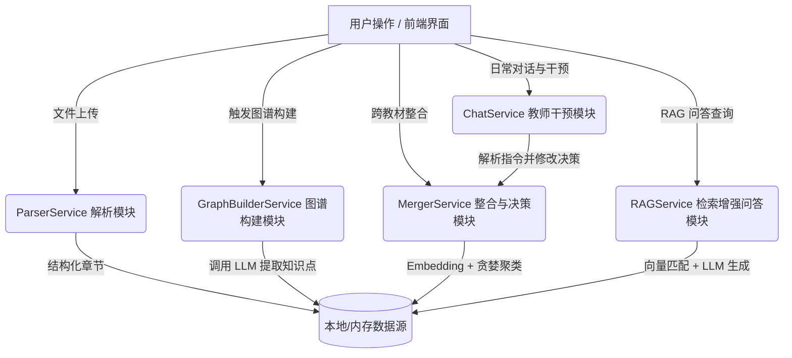

# 学科知识整合智能体 - Agent 架构说明

## 1. 架构总览

本系统采用**服务化调度（Service-Oriented Orchestration）**架构，而非复杂的多智能体（Multi-Agent）对话流。我们将复杂的任务拆解为独立的服务类，由核心路由器接收前端指令后，调用不同的 Service 与 LLM 进行针对性的交互。

## 2. 设计决策论证

### 为什么选择服务化单 Agent 架构，而不是拆分多 Agent？

1. **上下文管理复杂度**：知识图谱构建和合并涉及大量的数据（每本教材可能多达几十章，产生数百个节点）。如果使用多 Agent 相互对话传递这些数据，不仅容易导致上下文超长（Token 浪费），还极易产生信息截断和格式丢失。
2. **确定性与可控性**：教材处理是一个**强流程性**工作（解析 -> 提取 -> 合并 -> RAG）。使用代码控制的 Service 流程配合特定任务的 Prompt，能保证 100% 的流程控制，避免了多 Agent 协作时可能出现的“聊天偏题”或“死循环”。
3. **性能瓶颈**：我们的瓶颈在于 LLM 的并发请求。通过 `asyncio.Semaphore` 在 `GraphBuilderService` 中控制单 Agent 的并发度，比多个 Agent 抢占资源更容易实现限流和稳定提取。

## 3. 数据流与调用链路

一次完整的“上传 -> 构建 -> 整合 -> 问答”数据流如下：

1. **文本输入层**：用户上传 PDF/MD，`ParserService` 利用正则表达式和结构化清洗技术，将文档转化为结构化的 `Chapter` 对象并落盘。
2. **知识提取层**：`GraphBuilderService` 遍历章节，通过专门设计的架构师级 Prompt 指导 LLM 提取知识点。
3. **跨域合并层**：`MergerService` 使用 Sentence-Transformer 计算 Embedding 向量，通过余弦相似度进行聚类，再生成合并决策。
4. **人在回路（Human-in-the-loop）**：`ChatService` 负责与教师交互，将自然语言指令转换为决策修改逻辑。
5. **RAG 问答层**：`RAGService` 对原始文档分块向量化存入 ChromaDB，并在回答时引用具体出处。

## 4. Prompt 工程与提取粒度优化 (核心竞争力)

针对大部头教材（如 500+ 页 PDF）导致图谱节点爆炸的问题，我们对知识提取 Prompt 进行了三轮迭代，实现了“骨架级”提炼：

1. **极端控量策略 (Resource Scarcity)**：在 Prompt 中明确定义“名额稀缺”概念，强制 AI 每章节仅提取 3-5 个最重要的“脊柱”知识点。这有效避免了图谱沦为“名词解释大全”，确保了宏观结构的清晰。
2. **高质量属性约束 (Metadata Richness)**：严格要求每个节点必须附带 `definition`（定义）、`category`（分类）和 `page`（溯源页码）。通过 Pydantic 校验和 Prompt 强引导，解决了 AI 偷懒导致字段缺失的问题，确保点击节点时侧边栏内容充实。
3. **启发式章节过滤**：在调用 LLM 前，通过 `skip_keywords` 预过滤目录、附录、编委名单等非核心内容，并针对 PDF 常见的“页眉重复切章”问题设计了模糊对比算法，大幅节省了 Token 消耗并提升了提取质量。

## 5. 取舍与权衡 (Trade-offs)

### 放弃的方案：
- **放弃 Neo4j 数据库**：为了降低部署门槛，满足黑客松“开箱即用”的要求，放弃了重量级的图数据库，改为内存 + JSON 文件的轻量级存储。
- **放弃纯 LLM 融合节点**：早期尝试让 LLM 一次性吞下两本书的节点进行合并，发现不仅慢且极易遗漏。最终改为 **Embedding 聚类算法计算 + 规则确认** 的方案。

### 已知局限与未来改进：
1. **持久化存储**：当前使用 JSON 落盘，当教材数量达到百本级别时，内存占用和启动时间会成为瓶颈。未来应迁移至 PostgreSQL + pgvector + Neo4j 混合存储架构。
2. **Rerank 重排**：目前的 RAG 仅使用了一次向量检索。如果有更多时间，应当在 ChromaDB 检索出 Top-20 后，加入 BGE-Reranker 模型进行精排，从而提升引用和回答的准确率。
3. **图谱 RAG（GraphRAG）**：目前 RAG 只检索了文本 Chunk，未来可以探索将提取出的图谱关系网络也作为 Context 注入给 LLM，实现跨文档的复杂推理问答。
