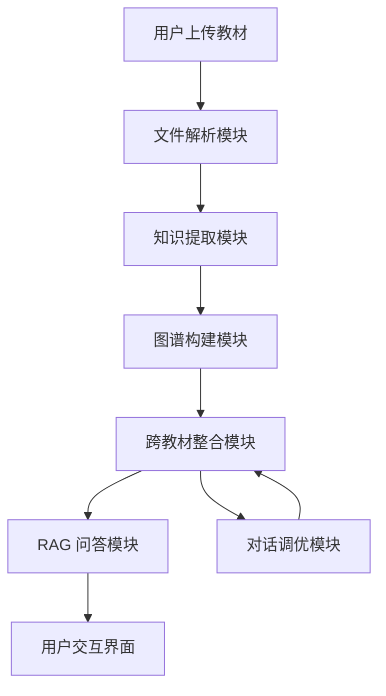

# Agent 架构说明

## 架构总览

本系统采用 **单 Agent 多模块** 架构：由一个主控流程调度各业务模块，各模块内部通过结构化 Prompt 调用 LLM，而非多个独立 Agent 协作。

## 设计决策论证

### 为什么选择单 Agent 而非多 Agent？

1. **任务耦合度高**：教材解析 → 知识提取 → 图谱构建 → 整合 → RAG 是一条强依赖流水线，每个步骤的输出是下一步的输入。多 Agent 通信开销大，且比赛 5 小时内开发多 Agent 协调机制风险高。
2. **Prompt 复杂度可控**：每个模块的 Prompt 独立封装在 Service 中，复杂度通过 "一次只处理一个章节" 和严格 JSON Schema 约束来控制，上下文长度不会超限。
3. **调试成本低**：单 Agent 架构下，数据流在内存中传递，出现问题时容易定位到具体模块；多 Agent 需要日志追踪和消息队列调试。

### 模块职责边界

| 模块                | 职责                          | 与 LLM 的交互         |
| ------------------- | ----------------------------- | --------------------- |
| ParserService       | PDF/文本解析为结构化章节      | 无（纯规则解析）      |
| GraphBuilderService | 逐章提取知识点和关系          | 每章一次 LLM 调用     |
| MergerService       | Embedding 聚类 + LLM 精判重复 | 候选对调用 LLM 二判   |
| RAGService          | 分块、索引、检索、生成        | Query 时一次 LLM 调用 |
| ChatService         | 解析用户意图、修改整合结果    | 每次对话一次 LLM 调用 |

## 数据流与调用链路

**一次完整流程：**

1. 用户上传 PDF → `POST /api/upload/` → 文件落盘 `data/uploaded/`
2. 前端自动调用 `POST /api/parse/{book_id}` → `ParserService.parse()` → 产出 `Textbook` 对象存入 `StorageService.books`
3. 用户在教材列表点击「构建图谱」→ `POST /api/graph/build/{book_id}` → `GraphBuilderService.build()` → 逐章调用 `LLMClient.extract_knowledge()` → 产出 `GraphData` 存入 `StorageService.graphs`
4. 用户点击「执行整合」→ `POST /api/merge/` → `MergerService.merge_all()`:
   - 收集所有 nodes → `EmbeddingService.encode()` → 计算相似度矩阵
   - 相似度 > 阈值的对 → `LLMClient.ask()` 精判是否等价
   - 生成 `MergeDecision` 列表，构建 `merged_graph`
5. 用户点击「建立索引」→ `POST /api/rag/index` → `RAGService.index_all()`:
   - 按 600 字 / 100 字重叠分 chunk → `EmbeddingService.encode()` → 存入 ChromaDB
6. 用户提问 → `POST /api/rag/query` → 问题 embedding → 检索 top-5 chunk → 组装 Prompt → `LLMClient.ask()` → 返回带引用的 `RAGQueryResponse`

## 取舍与权衡

### 放弃的方案

- **Cytoscape.js**: 虽然图谱效果更专业，但不太好使用，ECharts Graph 已能满足力导向图 + 点击交互需求。
- **多 Agent 框架（如 LangGraph / AutoGen）**: 比赛时间有限，引入框架会增加不可控因素，手写模块调度更可控。
- **混合检索（向量 + BM25）**: 作为加分项，如果时间充裕再追加；基础功能优先保证向量检索通路。

### 已知局限

1. **PDF 解析精度**：基于正则和字体大小推断章节标题，对扫描版 PDF 或复杂排版支持有限。
2. **内存存储**：`StorageService` 使用内存 dict，重启后数据丢失（可快速扩展为 json 文件持久化）。
3. **LLM 调用成本**：每本教材每章一次 LLM 调用，7 本教材 × 20 章 ≈ 140 次调用；已限制 Prompt 只处理单章。
4. **LLM 响应速度**: 大部分大模型供应商对API请求都有速率限制，在产生图谱时容易中途丢失响应。

### 如果有更多时间

1. 引入图数据库（Neo4j）存储知识图谱，支持复杂图查询。
2. 实现混合检索 + Rerank，提升 RAG 准确率。
3. 将单 Agent 拆分为 "提取 Agent" + "整合 Agent" + "问答 Agent"，通过共享状态协调。
